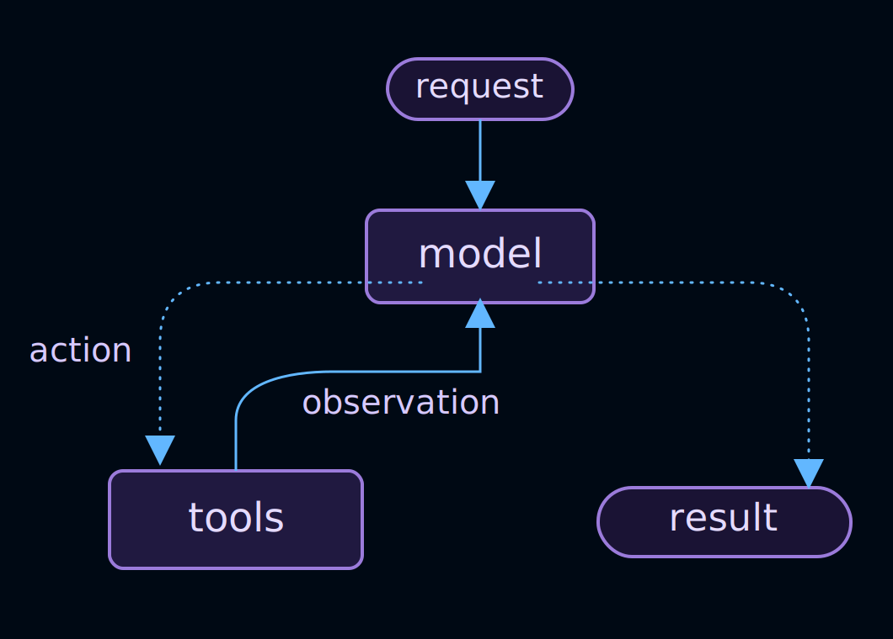
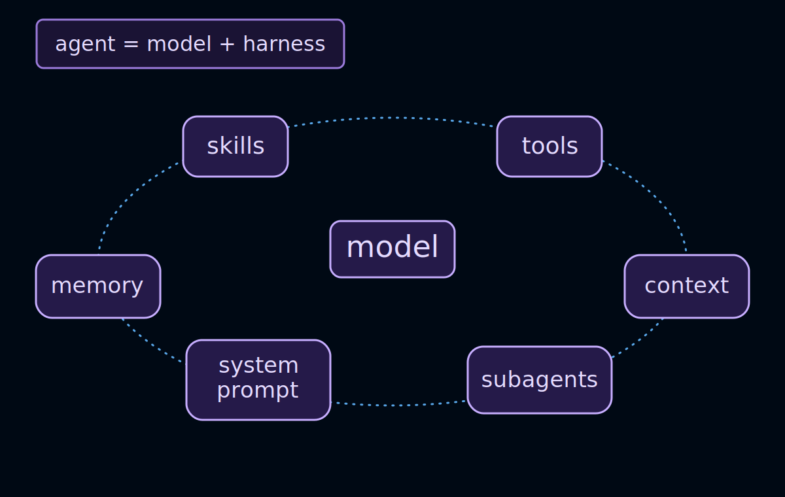
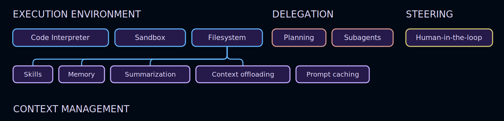

# Agents（智能体）

> 原文链接：https://docs.langchain.com/oss/python/langchain/agents

Agent（智能体）是一个在循环中调用工具的模型，直到任务完成。



> **Agent = Model + Harness**
>
> Harness 的工作：在正确的时间为给定的任务提供正确的上下文。

Harness 是围绕这个循环的一切：模型、提示词、工具以及任何影响其行为中间件。

[`create_agent`](https://reference.langchain.com/python/langchain/agents/factory/create_agent) 是一个高度可配置的 harness。最简单的创建方式：

```python
from langchain.agents import create_agent

agent = create_agent(model="deepseek:deepseek-v4-pro", tools=tools)
```

在此基础上，你可以通过 `model=`、`tools=` 和 `system_prompt=` 参数配置基础功能。对于更高级的功能，可以使用 [中间件](#配置-harness) 扩展 harness。

## 核心组件



### Model（模型）

传入模型标识字符串（`"provider:model"`）或初始化的模型实例来选择你的 agent 使用的模型。更多参数、提供商设置和动态模型选择，请参阅 [Models](/oss/python/langchain/models)。

```python
from langchain.agents import create_agent

agent = create_agent(model="deepseek:deepseek-v4-pro", tools=tools)
```

支持的模型提供商：

| 提供商 | 格式示例 |
|--------|----------|
| Google | `"google_genai:gemini-3.5-flash"` |
| OpenAI | `"openai:gpt-5.4"` |
| Anthropic | `"anthropic:claude-sonnet-4-6"` |
| OpenRouter | `"openrouter:anthropic/claude-sonnet-4-6"` |
| Fireworks | `"fireworks:accounts/fireworks/models/qwen3p5-397b-a17b"` |
| Baseten | `"baseten:zai-org/GLM-5.2"` |
| Ollama | `"ollama:devstral-2"` |
| DeepSeek | `"deepseek:deepseek-v4-pro"` |

### Tools（工具）

要为 agent 提供工具，可以传入任何 Python 可调用对象、LangChain 工具或工具字典。更多工具定义、上下文访问和动态工具选择，请参阅 [Tools](/oss/python/langchain/tools)。

```python
from langchain.agents import create_agent
from langchain.tools import tool


@tool
def search(query: str) -> str:
    """搜索信息。"""
    return f"搜索结果：{query}"


agent = create_agent(model="deepseek:deepseek-v4-pro", tools=[search])
```

**关键点**：
- 函数的 `docstring`（文档字符串）会作为工具描述传给模型
- 参数名和类型注解会成为工具的 schema
- 模型根据这些信息判断何时调用工具、如何传参

### System prompt（系统提示词）

定义 agent 如何处理任务。系统提示词参数接受字符串或 `SystemMessage`。如需运行时动态提示词，请使用 [中间件](/oss/python/langchain/middleware)。

```python
agent = create_agent(
    model="deepseek:deepseek-v4-pro",
    tools=tools,
    system_prompt="你是一个有帮助的助手。回答要简洁准确。",
)
```

### Structured output（结构化输出）

使用 `response_format=` 从 agent 返回经过验证的结构化数据。更多策略和示例，请参阅 [Structured output](/oss/python/langchain/structured-output)。

```python
from pydantic import BaseModel
from langchain.agents import create_agent


class Answer(BaseModel):
    summary: str
    confidence: float


agent = create_agent(model="deepseek:deepseek-v4-pro", tools=tools, response_format=Answer)
result = agent.invoke({"messages": [{"role": "user", "content": "总结 AI 趋势"}]})
result["structured_response"]  # Answer(summary=..., confidence=...)
```

## 调用（Invocation）

> **提示**：使用 [LangSmith](https://smith.langchain.com) 追踪循环的每个步骤、调试工具调用并评估 agent 输出。

你可以通过消息调用 agent。在底层，这会将更新传递给 agent 的 [`State`](/oss/python/langgraph/graph-api#state)。所有 agent 在其状态中包含一个[消息序列](/oss/python/langgraph/use-graph-api#messagesstate)；要调用 agent，需要传入新消息以及 `thread_id`，以便 agent 可以持久化和恢复对话历史：

```python
from langchain.agents import create_agent
from langchain_core.utils.uuid import uuid7
from langgraph.checkpoint.memory import InMemorySaver

agent = create_agent(
    model="deepseek:deepseek-v4-pro",
    tools=[],
    checkpointer=InMemorySaver(),
)

config = {"configurable": {"thread_id": str(uuid7())}}

result = agent.invoke(
    {"messages": [{"role": "user", "content": "旧金山的天气怎么样？"}]},
    config=config,
)

# 同一对话的后续轮次：重用相同的 thread_id 以保持历史
result = agent.invoke(
    {"messages": [{"role": "user", "content": "明天呢？"}]},
    config=config,
)
```

> **注意**：使用 `thread_id` 持久化对话历史需要配置 [checkpointer](/oss/python/langchain/long-term-memory)。部署在 [LangSmith](/langsmith/deployment) 上时，checkpointer 会自动配置。本地使用时需要显式传入，例如 `create_agent(..., checkpointer=InMemorySaver())`。

如果你还需要向工具和中间件传递每次运行的配置（如用户 ID、API 密钥或功能标志），可以将其作为 `context` 与 `config` 一起传递。使用 `context_schema` 定义数据形状，并通过 `runtime.context` 访问：

```python
from dataclasses import dataclass

from langchain.agents import create_agent
from langchain_core.utils.uuid import uuid7
from langgraph.checkpoint.memory import InMemorySaver


@dataclass
class Context:
    user_id: str


agent = create_agent(
    model="deepseek:deepseek-v4-pro",
    tools=[],
    context_schema=Context,
    checkpointer=InMemorySaver(),
)

result = agent.invoke(
    {"messages": [{"role": "user", "content": "旧金山的天气怎么样？"}]},
    config={"configurable": {"thread_id": str(uuid7())}},
    context=Context(user_id="user-123"),
)
```

`thread_id` 限定*对话*范围（消息历史、检查点），而 `context` 携带*每次运行*的数据，供工具和中间件在调用时读取。两者通常一起传递。更多详情请参阅 [tool context](/oss/python/langchain/tools#context) 和 [Runtime](/oss/python/langchain/runtime)。

## 流式输出（Streaming）

`invoke` 在运行结束时返回最终响应。如果 agent 执行了多个工具调用，用户通常需要在完成前获取进度更新。使用流式输出可以实时显示中间消息和工具活动。

```python
from langchain.messages import AIMessage, HumanMessage


stream = agent.stream_events(
    {"messages": [{"role": "user", "content": "搜索 AI 新闻并总结发现"}]},
    version="v3",
)
for snapshot in stream.values:
    # 每个快照包含该点的完整状态
    latest_message = snapshot["messages"][-1]
    if latest_message.content:
        if isinstance(latest_message, HumanMessage):
            print(f"用户：{latest_message.content}")
        elif isinstance(latest_message, AIMessage):
            print(f"Agent：{latest_message.content}")
    elif latest_message.tool_calls:
        print(f"调用工具：{[tc['name'] for tc in latest_message.tool_calls]}")
```

> **提示**：更多流式模式、事件类型和 UI 模式，请参阅 [Streaming](/oss/python/langchain/streaming)。

## 配置 Harness

`create_agent` 具有高度可扩展性。中间件是自定义的基本单元：每个单元处理一个关注点，在适当的时机挂钩 agent 循环，并且可以与其他中间件自由组合。根据你的用例选择所需的功能。

常见模式已经预构建为一等中间件。你也可以构建任何 [自定义中间件](/oss/python/langchain/middleware/custom)。



随着 agent 承担更复杂的工作，它们需要在几个关键领域获得支持。中间件生态系统提供：

| 类别 | 说明 |
|------|------|
| **执行环境** | 工具、文件系统、沙箱和代码执行 |
| **上下文管理** | 摘要、记忆、技能和提示缓存 |
| **规划和委派** | 待办列表和子代理用于并行、隔离的工作 |
| **容错** | 重试、回退和调用限制 |
| **护栏** | PII 检测和内容控制 |
| **引导** | 在高影响操作前进行人工审批 |

> **提示**：`create_deep_agent` 为长时间运行的编码和研究任务预组装了这个堆栈（默认包含文件系统、摘要、子代理和提示缓存）。完整预构建 harness 请参阅 [Deep Agents](/oss/python/deepagents/harness)。

### 执行环境（Execution environment）

Agent 在能够采取行动而不仅仅是生成文本时特别有用。执行环境为 agent 提供工作空间：可以调用的工具、用于跨轮次读写文件的文件系统，以及用于运行脚本或 shell 命令的代码执行。

```python
from langchain.agents import create_agent
from deepagents.backends import StateBackend
from deepagents.middleware import FilesystemMiddleware

agent = create_agent(
    model="deepseek:deepseek-v4-pro",
    tools=[search],
    middleware=[FilesystemMiddleware(backend=StateBackend())],
)
```

相关文档：[`FilesystemMiddleware`](https://reference.langchain.com/python/deepagents/middleware/filesystem/FilesystemMiddleware)、[Sandboxes](/oss/python/deepagents/sandboxes)、[Interpreters](/oss/python/deepagents/interpreters)。

### 上下文管理（Context management）

每次模型调用都有固定的上下文窗口。随着 agent 运行，该窗口会被累积的历史、工具结果和中间步骤填满。摘要在溢出前压缩历史；记忆在启动时加载持久化指令，使知识跨会话携带；技能按需显示领域知识，而不是预先加载所有内容。

```python
from deepagents.backends import StateBackend
from deepagents.middleware import (
    FilesystemMiddleware,
    MemoryMiddleware,
    SkillsMiddleware,
    SummarizationMiddleware,
)

backend = StateBackend()
model = "deepseek:deepseek-v4-pro"

agent = create_agent(
    model=model,
    tools=[search],
    middleware=[
        FilesystemMiddleware(backend=backend),
        SummarizationMiddleware(model=model, backend=backend),
        MemoryMiddleware(backend=backend, sources=["./AGENTS.md"]),
        SkillsMiddleware(backend=backend, sources=["./skills/"]),
    ],
)
```

相关文档：[`SummarizationMiddleware`](https://reference.langchain.com/python/langchain/agents/middleware/summarization/SummarizationMiddleware)、[`MemoryMiddleware`](https://reference.langchain.com/python/deepagents/middleware/memory/MemoryMiddleware)、[Skills](/oss/python/langchain/multi-agent/skills)、[Context engineering](/oss/python/deepagents/context-engineering)。

### 规划和委派（Planning and delegation）

复杂任务通常超出单个上下文窗口的处理能力。委派让主代理将工作分解成多个部分，交给在各自隔离上下文中运行的子代理，并专注于协调而非执行。工作可以并行运行；主代理的上下文保持整洁。

```python
from deepagents.backends import StateBackend
from deepagents.middleware import FilesystemMiddleware
from deepagents.middleware.subagents import SubAgentMiddleware
from langchain.agents import create_agent
from langchain.agents.middleware import TodoListMiddleware
from langchain.tools import tool


@tool
def search(query: str) -> str:
    """搜索查询并返回简短摘要。"""
    return f"搜索结果：{query}"


backend = StateBackend()

agent = create_agent(
    model="deepseek:deepseek-v4-pro",
    tools=[search],
    middleware=[
        FilesystemMiddleware(backend=backend),
        TodoListMiddleware(),
        SubAgentMiddleware(
            backend=backend,
            subagents=[
                {
                    "name": "researcher",
                    "description": "搜索并返回结构化摘要。",
                    "system_prompt": "使用搜索工具研究问题并总结关键点。",
                    "tools": [search],
                    "model": "deepseek:deepseek-v4-pro",
                    "middleware": [],
                }
            ],
        ),
    ],
)
```

相关文档：[Subagents](/oss/python/langchain/multi-agent/subagents)。

### 命名你的 Agent

可选地使用标识符命名 agent。这在将 agent 作为子图嵌入[多代理](/oss/python/langchain/multi-agent)系统时特别有用。

```python
agent = create_agent(
    model="deepseek:deepseek-v4-pro",
    tools=tools,
    name="research_assistant"
)
```

### 容错（Fault tolerance）

生产环境中的 agent 会遇到开发中很少出现的失败：速率限制、模型超时、临时 API 错误。容错中间件在基础设施层面处理这些问题，这样你的工具和业务逻辑就不需要在每次调用周围使用 try/catch。

```python
from langchain.agents import create_agent
from langchain.agents.middleware import ModelRetryMiddleware, ToolRetryMiddleware
from langchain.tools import tool


@tool
def search(query: str) -> str:
    """搜索查询并返回简短摘要。"""
    return f"搜索结果：{query}"


agent = create_agent(
    model="deepseek:deepseek-v4-pro",
    tools=[search],
    middleware=[
        ModelRetryMiddleware(max_retries=3),  # 模型调用重试 3 次
        ToolRetryMiddleware(max_retries=2),   # 工具调用重试 2 次
    ],
)
```

相关文档：[`ModelRetryMiddleware`](https://reference.langchain.com/python/langchain/agents/middleware/model_retry/ModelRetryMiddleware)、[`ToolRetryMiddleware`](https://reference.langchain.com/python/langchain/agents/middleware/tool_retry/ToolRetryMiddleware)、[Prebuilt middleware](/oss/python/langchain/middleware/built-in)。

### 护栏（Guardrails）

有些策略不能只靠提示词——需要在数据流入模型上下文之前确定性地执行合规规则。护栏在数据通过 agent 循环流动时拦截数据，在工具结果到达模型上下文之前应用合规规则或内容策略。

```python
from langchain.agents import create_agent
from langchain.agents.middleware import PIIMiddleware
from langchain.tools import tool


@tool
def search(query: str) -> str:
    """搜索查询并返回简短摘要。"""
    return f"搜索结果：{query}"


agent = create_agent(
    model="deepseek:deepseek-v4-pro",
    tools=[search],
    middleware=[PIIMiddleware("email")],  # PII（个人身份信息）检测
)
```

相关文档：[`PIIMiddleware`](https://reference.langchain.com/python/langchain/agents/middleware/pii/PIIMiddleware)、[Prebuilt middleware](/oss/python/langchain/middleware/built-in)。

### 引导（Steering）

完全的自主性并不总是合适的。引导让你在特定决策点放置人工干预——在破坏性写入、昂贵的 API 调用或任何需要判断的操作之前——而不需要重构你的 agent。Agent 暂停等待；人工批准、编辑或拒绝；执行继续。

```python
from langchain.agents import create_agent
from langchain.agents.middleware import HumanInTheLoopMiddleware
from langchain.tools import tool


@tool
def write_file(path: str, content: str) -> str:
    """写入文件。"""
    # ...
    pass


agent = create_agent(
    model="deepseek:deepseek-v4-pro",
    tools=[write_file],
    middleware=[HumanInTheLoopMiddleware(
        interrupt_on={"write_file": True}  # 写入文件前需要人工确认
    )],
)
```

相关文档：[`HumanInTheLoopMiddleware`](https://reference.langchain.com/python/langchain/agents/middleware/human_in_the_loop/HumanInTheLoopMiddleware)、[Human-in-the-loop](/oss/python/langchain/human-in-the-loop)。

### 中间件资源

| 资源 | 说明 |
|------|------|
| [中间件概览](/oss/python/langchain/middleware/overview) | 中间件栈如何工作以及钩子何时触发 |
| [预构建中间件](/oss/python/langchain/middleware/built-in) | 完整参考和配置示例 |
| [自定义中间件](/oss/python/langchain/middleware/custom) | 为业务逻辑、PII 清理等编写自己的钩子 |

---

> **原文链接**：https://docs.langchain.com/oss/python/langchain/agents
>
> **图片资源**：本地路径 `../images/`
